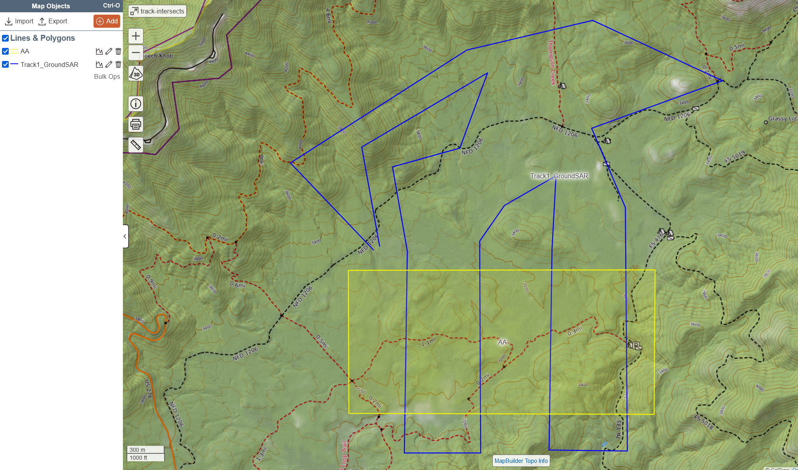

## Problem:

GPS tracks returned contain data outside of the search segment.

## Desired Result:

This software trims GPS data to retain only the parts that reside inside a search segment.  It makes various calculations based on those data.

## Necessary Software and Steps:

### Install Anaconda 
https://anaconda.org/

### Import Environment 
Environment:

https://github.com/osajus/SAR_trim_tracks_within_segment/blob/main/anaconda_env.yaml

Importing Instructions:

   https://docs.anaconda.com/navigator/tutorials/manage-environments/#importing-an-environment

Run Environment

You MUST run Python (or VSC) from the Anaconda Navigator Dashboard so the environment is used.

### Import Python Source

https://github.com/osajus/SAR_trim_tracks_within_segment/blob/main/polygon%20intersect.py

### Export SARTopo map objects
https://github.com/osajus/SAR_trim_tracks_within_segment/blob/main/track-intersects.json

 
# Example:
https://sartopo.com/m/VVGNCMV

This demonstration contains:

A single segment labeled “AA” 
- Baseline ~ 1.5 mi
- Length ~ 0.7 mi
- Area ~ 1.05 mi^2

A single GPS track labeled “Track1_GroundSAR”
- Total Track: 12.22 mi
- Searchers: 5
- Search Speed: 0.5 mph
- Search Time: 5.6 hr
- ESW: 35

This polygon and linestring were exported as a geoJSON file into the path where the python script is stored.

Within the python script, parameters are adjusted to match the description above.
 
# Output

After running the program, the console output shows the following:

    TL within segment: 4514.52 (m) | 14811 (ft)
    TTL within segment: 22572.61 (m) | 74057 (ft)
    Area effectively searched: 240804.59 (m) | 2591998.99 (ft)
    Coverage: 8.87%

Output file demo: 
https://github.com/osajus/SAR_trim_tracks_within_segment/blob/main/output_intersected.geojson

The output file *can* be imported into SARTopo.  Calculated data has been added to the track’s description field.

**Important Note**

Since the tracks are now split, they will show as individual SARTopo objects.  This isn’t a large issue with the demo as there are only four tracks, however, this has the possibility of becoming quite unruly.  I’m not aware of a method to join them into a single line without introducing unwanted and inaccurate data.

 
# Disclaimer
This software has very limited testing and no field testing.  Use at your own risk.  I make no statements regarding accuracy of the data.  The software is distributed AS IS and is subject to the license as defined in the Github repo. 